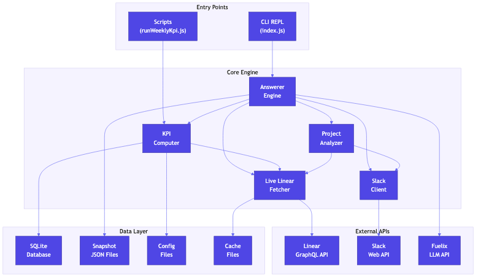
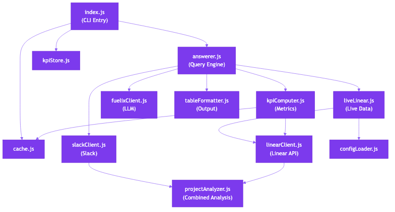
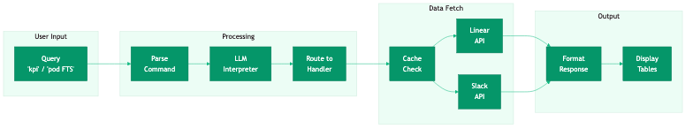
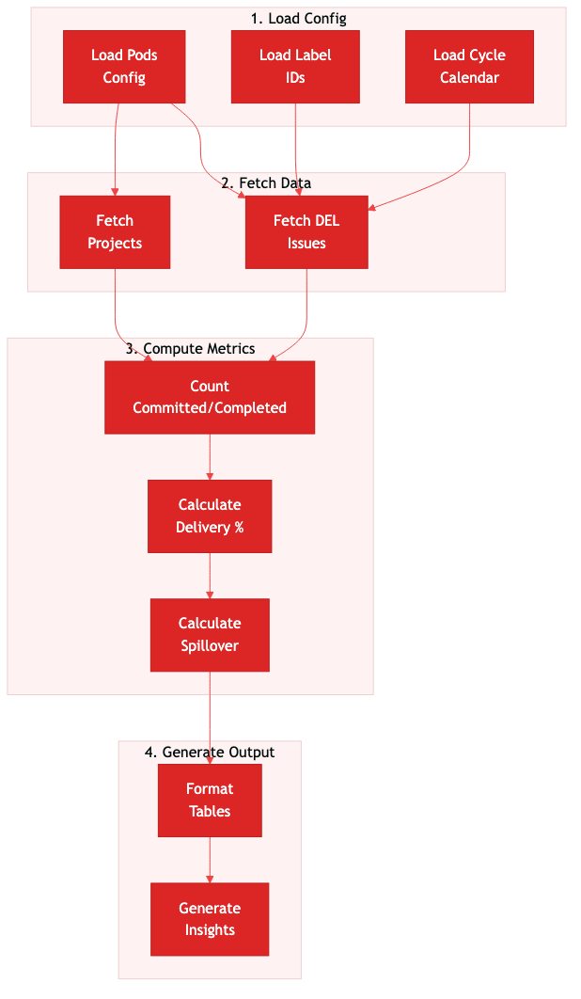

# Linear KPI Runner - Technical Implementation Notes

## Table of Contents
1. [System Overview](#system-overview)
2. [Architecture](#architecture)
3. [Core Modules](#core-modules)
4. [KPI Computation Logic](#kpi-computation-logic)
5. [Slack Integration](#slack-integration)
6. [LLM Query Interpreter](#llm-query-interpreter)
7. [Historical Data & Context Capture](#historical-data--context-capture)
8. [Caching Strategy](#caching-strategy)
9. [Configuration Management](#configuration-management)
10. [API Reference](#api-reference)
11. [Database Schema](#database-schema)

---

## System Overview

Linear KPI Runner is an intelligent CLI-based KPI tracking system for engineering teams using Linear project management.

### Key Features

| Feature | Description |
|---------|-------------|
| **DEL KPI** | Delivery Excellence Level metrics (Committed vs Completed deliverables) |
| **Feature Movement** | Project state tracking (Done/In-Flight/Not Started) |
| **Live Queries** | Real-time Linear API integration |
| **Snapshot System** | Point-in-time data capture for historical analysis |
| **Slack Integration** | Key discussions from team channels with user resolution |
| **LLM Query Interpreter** | Natural language understanding with typo correction |
| **Project Deep Dive** | Comprehensive project analysis combining Linear + Slack data |
| **Historical Analysis** | Q1 retrospective data capture and trend tracking |

### Tech Stack

| Component | Technology |
|-----------|------------|
| Runtime | Node.js (ES6+) |
| Database | SQLite (better-sqlite3) |
| APIs | Linear GraphQL API, Slack Web API |
| LLM | Fuelix API (GPT-5.2) |
| Cache | File-based TTL cache + localStorage |

### Supported Pods (9 Total)

| Pod Name | Alias | Description |
|----------|-------|-------------|
| FTS | - | Full-Task Service |
| GTS | - | Ground Truth Service |
| Platform | - | Platform Infrastructure |
| Control Center | - | Operations Control |
| Talent Studio | - | Talent Management |
| Growth & Reuse | GR | Growth & Reuse Team |
| ML | - | Machine Learning Team |
| FOT | - | Field Operations Technology |
| BTS | - | Business Technology Services |

---

## Architecture

### System Architecture Diagram



### High-Level System Components

The system is organized into four main layers:

**1. Entry Points**
- CLI REPL (`index.js`) - Interactive command-line interface
- Scripts (`runWeeklyKpi.js`, `captureContext.js`) - Automated batch processing

**2. External APIs**
- Linear GraphQL API - Project and issue data
- Slack Web API - Team discussions and messages
- Fuelix LLM API - Natural language query processing

**3. Core Engine**
- Answerer Engine - Command parsing and response generation
- KPI Computer - Metrics calculation
- Live Linear Fetcher - Real-time data retrieval
- Slack Client - Team communication data
- Project Analyzer - Combined Slack + Linear analysis

**4. Data Layer**
- SQLite Database (`state/kpi_state.db`)
- Snapshot JSON files (`output/`)
- Configuration files (`config/`)
- Cache files (`cache/`)

### Module Dependencies



| Module | Dependencies | Purpose |
|--------|--------------|---------|
| `index.js` | answerer, kpiStore, cache, liveLinear | CLI entry point |
| `answerer.js` | liveLinear, kpiComputer, fuelixClient, tableFormatter, slackClient | Query processing |
| `kpiComputer.js` | linearClient, cache, configLoader | KPI calculations |
| `liveLinear.js` | linearClient, configLoader, cache | Live data fetching |
| `slackClient.js` | - | Slack API wrapper |
| `projectAnalyzer.js` | linearClient, slackClient, projectChannelMapper | Combined analysis |

### Data Flow



**User Query Flow:**
1. User enters query → CLI REPL
2. Query parsed by `parseCommand()` or sent to LLM interpreter
3. Command routed to appropriate handler
4. Data fetched from Linear/Slack/Cache
5. Response formatted and displayed

**KPI Computation Flow:**
1. Load configuration (pods, labels, cycle calendar)
2. Fetch DEL issues from Linear API
3. For each cycle C1-C6: count committed/completed
4. Calculate delivery percentages and spillover
5. Format tables and generate insights

---

## Core Modules

### 1. Answer Engine (`answerer.js`)

**Command Types Supported:**

| Command Type | Example | Description |
|--------------|---------|-------------|
| `all_pods_summary` | "kpi", "what's happening this week" | Cross-pod KPI dashboard |
| `pod_summary` | "pod FTS" | Single pod overview |
| `pod_narrative` | "what's going on in FTS" | Rich pod narrative |
| `pod_projects` | "pod FTS projects" | List pod projects |
| `project_detail` | "project tagging" | Project details |
| `project_deep_dive` | "deep dive AI interviewer" | Full Slack+Linear analysis |
| `project_blockers` | "project X blockers" | Show blockers |
| `dels_by_cycle` | "DELs in C1" | DELs planned for cycle |
| `pending_dels` | "pending dels" | Incomplete DELs |

**Key Functions:**

| Function | Purpose |
|----------|---------|
| `parseCommand(input)` | Parse user input into command structure |
| `interpretQueryWithLLM()` | Use LLM for typo correction and intent extraction |
| `extractPodFromQuery()` | Find pod name in query |
| `extractProjectFromNaturalLanguage()` | Extract project from natural queries |
| `fetchPodFeatureReadiness()` | Get PRD/Design/Dev status per project |

### 2. KPI Computer (`kpiComputer.js`)

**Computation Functions:**

| Function | Purpose |
|----------|---------|
| `computeCycleKpi()` | DEL metrics per pod/cycle |
| `computeFeatureMovement()` | Project states per pod |
| `computeCombinedKpi()` | Both metrics + project summaries |
| `fetchPendingDELs()` | Get incomplete DELs by pod |
| `fetchDELsByCycle()` | DELs planned for specific cycle |

**Helper Functions:**

| Function | Purpose |
|----------|---------|
| `getCycleKeyByDate()` | Determine current cycle from date |
| `isCycleActive()` | Check if cycle is currently active |
| `getBestCycleByCommitted()` | Find cycle with most committed DELs |

### 3. Linear Client (`linearClient.js`)

**API Methods:**

| Method | Purpose |
|--------|---------|
| `gql(query, variables)` | Execute GraphQL query |
| `findTeamByName(name)` | Find team by name |
| `getProjectsByInitiative(id)` | Get projects for initiative |
| `getIssuesByTeam(teamId)` | Get team issues |
| `getIssuesByProject(projectId)` | Get project issues |
| `getIssueComments(issueId, limit)` | Get issue comments |
| `getFeatureReadiness(projectId)` | Get PRD/Design/Dev phases |

### 4. Slack Client (`slackClient.js`)

**API Methods:**

| Method | Format | Purpose |
|--------|--------|---------|
| `getMessages(channelId)` | JSON | Get channel messages |
| `getAllMessages(channelId)` | JSON | Get all with pagination |
| `getThreadReplies(channelId, ts)` | Form-urlencoded | Get thread replies |
| `getMessagesWithThreads()` | Mixed | Expand all threads |
| `getUserInfo(userId)` | Form-urlencoded | Resolve user ID to name |
| `resolveUserNames(userIds)` | Form-urlencoded | Batch resolve users |

### 5. Project Analyzer (`projectAnalyzer.js`)

**Purpose:** Combines Slack discussions + Linear comments into unified project analysis.

**Input:**
- Project ID
- Options: `daysBack` (default 14), `includeThreads` (default true)

**Output:**
- Project info
- Slack stats: messageCount, threadCount, participants
- Linear stats: issueCount, commentCount, participants
- Unified timeline of all events

### 6. Live Linear Layer (`liveLinear.js`)

**Cached Functions:**

| Function | Cache TTL | Purpose |
|----------|-----------|---------|
| `getLiveProjects(podName)` | 5 min | Get pod projects |
| `getLiveProject(pod, query)` | 5 min | Get single project |
| `getLiveBlockers(pod, project)` | 3 min | Get project blockers |
| `getLiveComments(pod, proj, days)` | 2 min | Get recent comments |
| `getLivePodSummary(podName)` | 5 min | Get pod overview |

---

## KPI Computation Logic

### KPI Computation Flow



### DEL (Delivery Excellence Level) Metrics

**Definitions:**

| Metric | Formula |
|--------|---------|
| **Committed** | Issues with DEL label + Cycle baseline label + NOT DEL-CANCELLED |
| **Completed** | Committed issues where state.type = "completed" AND completedAt <= cycleEnd |
| **Spillover** | committed - completed (0 if cycle active) |
| **Delivery %** | (completed / committed) × 100 |

### Cycle Detection Algorithm

```
1. Check each cycle C1-C6 for current date
2. If date falls within [start, end] → return that cycle
3. If no active cycle → return most recently ended cycle
4. Default fallback → C1
```

### Feature Movement States

| Project State | Normalized State |
|---------------|------------------|
| "completed" | "done" |
| "started", "paused" | "in_flight" |
| "planned", "backlog" | "not_started" |
| "canceled" | "cancelled" |

**Per Pod Metrics:**
- `plannedFeatures` = total projects
- `done` = count where state == "done"
- `inFlight` = count where state == "in_flight"
- `notStarted` = count where state == "not_started"

---

## Slack Integration

### Key Features

1. **Message Fetching** - Retrieve channel messages with pagination (unlimited)
2. **Thread Expansion** - Get all replies for threaded conversations
3. **User Resolution** - Convert `<@U12345>` mentions to actual names
4. **Rate Limiting** - Built-in delays to respect Slack API limits

### User ID Resolution Flow

| Step | Action | Example |
|------|--------|---------|
| 1 | Extract user IDs from text | Found: [U1234, U5678] |
| 2 | Call `users.info` for each ID | API returns user profiles |
| 3 | Build mapping | { U1234: "John", U5678: "Sarah" } |
| 4 | Replace in text | "Thanks John for Sarah's update" |

### API Methods by Format

| Method | Format | Notes |
|--------|--------|-------|
| `conversations.history` | JSON | Get channel messages |
| `conversations.replies` | Form-urlencoded | **Required** for thread replies |
| `users.info` | Form-urlencoded | **Required** for user lookup |
| `conversations.join` | JSON | Join public channel |
| `chat.postMessage` | JSON | Post messages |

### Key Discussions Feature

Combines both Slack messages and Linear comments to provide comprehensive view:

**Output Format:**
1. **PRD Review Meeting** (Slack - Jan 25) - John raised concerns about API design...
2. **Blocker: Database Migration** (Linear - Jan 24) - Sarah commented on schema conflicts...
3. **Design Sync** (Slack - Jan 23) - Team discussed UI components...

---

## LLM Query Interpreter

### Intent Types

| Intent | Description | Example Queries |
|--------|-------------|-----------------|
| `pod_info` | Information about a specific pod | "whats up with fts", "how is talent studio" |
| `project_info` | Information about a project | "AI interviewer status", "deep dive cohorts" |
| `all_pods` | Overview across all pods | "how are all teams doing", "overall status" |
| `unknown` | Cannot determine intent | "hello", ambiguous queries |

### Query Processing Flow

| Step | Input | Output |
|------|-------|--------|
| 1 | "whats going on AI Interviwer" | Send to LLM with context |
| 2 | LLM processes | Returns JSON with intent |
| 3 | Parse response | `{ intent: "project_info", entity: "AI Interviewer", confidence: "high" }` |
| 4 | Route to handler | `getLiveProject("AI Interviewer")` |

### LLM Response Format

```json
{
  "intent": "project_info",
  "entity": "AI Interviewer",
  "confidence": "high",
  "corrected_query": "What's going on with AI Interviewer project?"
}
```

### Confidence Levels

| Level | Confidence | Use Case |
|-------|------------|----------|
| High | >90% | Exact match or clear intent |
| Medium | 60-90% | Fuzzy match with context clues |
| Low | <60% | Ambiguous or unclear query |

---

## Historical Data & Context Capture

### Historical Data Service (`historicalDataService.js`)

**Purpose:** Capture quantitative metrics over time for trend analysis.

**Tables:**

| Table | Purpose |
|-------|---------|
| `weekly_snapshots` | Time-series metrics captured weekly |
| `cycle_closings` | End-of-cycle summaries with notes |
| `events_log` | Notable events, blockers, wins |
| `quarterly_goals` | Q1 goals vs actual values |

**Key Functions:**

| Function | Purpose |
|----------|---------|
| `captureWeeklySnapshot()` | Save current metrics |
| `closeCycle()` | Record cycle completion |
| `logEvent()` | Log notable events |
| `setQuarterlyGoal()` | Define pod goals |
| `getWeeklyTrend()` | Get metric trends |

### Context Capture Service (`contextCaptureService.js`)

**Purpose:** Capture qualitative data to understand "WHY" behind the numbers.

**Tables:**

| Table | Purpose |
|-------|---------|
| `linear_comments` | Issue comments with sentiment |
| `project_updates` | Status changes, descriptions |
| `slack_messages` | Team channel discussions |
| `del_issues` | DEL issue details |

**Classification Fields:**

| Field | Values | Purpose |
|-------|--------|---------|
| `sentiment` | positive/negative/neutral | Comment tone |
| `is_blocker` | true/false | Blocking issue indicator |
| `is_risk` | true/false | Risk indicator |
| `is_decision` | true/false | Decision recorded |
| `keywords` | text[] | Extracted topics |

### Weekly Snapshot Schema

| Field | Type | Description |
|-------|------|-------------|
| snapshot_date | TEXT | YYYY-MM-DD |
| week_number | INTEGER | Week of year |
| cycle | TEXT | C1-C6 |
| pod | TEXT | Pod name |
| committed_del | INTEGER | DELs committed |
| completed_del | INTEGER | DELs completed |
| delivery_pct | INTEGER | Delivery percentage |
| spillover | INTEGER | Spillover count |
| planned_features | INTEGER | Total projects |
| features_done | INTEGER | Completed projects |
| features_in_flight | INTEGER | Started projects |
| features_not_started | INTEGER | Backlog projects |

---

## Caching Strategy

### Cache Configuration

| Data Type | TTL | Location |
|-----------|-----|----------|
| Projects | 5 minutes | `agent/output/cache/` |
| Issues | 3 minutes | `agent/output/cache/` |
| Comments | 2 minutes | `agent/output/cache/` |
| Dashboard | Session | Browser localStorage |

### Cache Entry Structure

```json
{
  "data": "<cached response>",
  "expiresAt": 1706540400000
}
```

### Cache Flow

| Step | Condition | Action |
|------|-----------|--------|
| 1 | Check cache file | Look for key |
| 2a | HIT + not expired | Return cached data |
| 2b | MISS or expired | Fetch from API |
| 3 | Store response | Write to cache with TTL |
| 4 | Return | Return fresh data |

### Cache Decorator Pattern

```javascript
const fetchFn = withCache(
  `projects_${initiativeId}`,
  async () => client.getProjectsByInitiative(initiativeId),
  CACHE_TTL.projects
);
const projects = await fetchFn();
```

---

## Configuration Management

### Configuration Files

| File | Purpose | Auto-generated |
|------|---------|----------------|
| `config/linear_ids.json` | Primary pod/project config | Yes |
| `config/pods.json` | Manual pod config (fallback) | No |
| `config/cycle_calendar.json` | Cycle date ranges | No |
| `config/label_ids.json` | Label ID mappings | Yes |

### Config Load Priority

1. **Primary:** `config/linear_ids.json`
   - Contains: org, pods with initiativeId, projects

2. **Fallback:** `config/pods.json`
   - Contains: minimal pod config with teamId

### Pod Configuration Example

```json
{
  "org": {
    "id": "org-uuid",
    "name": "Telus Digital AI Engineering",
    "urlKey": "playment"
  },
  "pods": {
    "FTS": {
      "teamId": "team-uuid",
      "initiativeName": "Q1 2026 - FTS Roadmap",
      "initiativeId": "initiative-uuid",
      "projects": [...]
    },
    "ML": { ... },
    "FOT": { ... },
    "BTS": { ... }
  }
}
```

### Cycle Calendar Example

```json
{
  "pods": {
    "FTS": {
      "C1": { "start": "2026-01-06", "end": "2026-01-20" },
      "C2": { "start": "2026-01-20", "end": "2026-02-03" },
      "C3": { "start": "2026-02-03", "end": "2026-02-17" },
      "C4": { "start": "2026-02-17", "end": "2026-03-03" },
      "C5": { "start": "2026-03-03", "end": "2026-03-17" },
      "C6": { "start": "2026-03-17", "end": "2026-03-31" }
    }
  }
}
```

---

## API Reference

### Linear GraphQL Queries

**Fetch DEL Issues:**
```graphql
query IssuesByTeamAndLabel($teamId: ID!, $labelId: ID!) {
  issues(filter: {
    team: { id: { eq: $teamId } },
    labels: { id: { eq: $labelId } }
  }) {
    nodes {
      id, identifier, createdAt, completedAt
      state { type name }
      labels { nodes { id name } }
    }
  }
}
```

**Fetch Projects:**
```graphql
query ProjectsByInitiative($initiativeId: ID!) {
  projects(filter: {
    initiatives: { id: { eq: $initiativeId } }
  }) {
    nodes {
      id, name, state
      lead { name }
      targetDate, url, updatedAt
    }
  }
}
```

### CLI Commands Reference

| Command | Description | Handler |
|---------|-------------|---------|
| `kpi` | Combined DEL + Feature Movement | `all_pods_summary` |
| `weekly kpi` | Same as `kpi` | `all_pods_summary` |
| `what's going on across all pods` | Cross-pod summary | `all_pods_summary` |
| `pods` | List all pods | `list_pods` |
| `pod <name>` | Pod summary | `pod_summary` |
| `pod <name> projects` | List pod projects | `pod_projects` |
| `what's going on in <pod>` | Rich pod narrative | `pod_narrative` |
| `project <name>` | Project details | `project_detail` |
| `deep dive <project>` | Full analysis (Slack+Linear) | `project_deep_dive` |
| `project <name> blockers` | Show blockers | `project_blockers` |
| `DELs in C1` | DELs planned for cycle | `dels_by_cycle` |
| `pending dels` | Show incomplete DELs | `pending_dels` |
| `del kpi` | DEL-only KPI table | `del_kpi` |
| `debug` | Toggle debug mode | `debug_mode` |
| `clear cache` | Clear API cache | `clear_cache` |

---

## Database Schema

### SQLite Tables (`state/kpi_state.db`)

**Core Tables:**

| Table | Purpose |
|-------|---------|
| `snapshots` | Snapshot issue tracking |
| `snapshot_meta` | Snapshot metadata with freeze status |
| `weekly_snapshots` | Historical weekly metrics |
| `cycle_closings` | End-of-cycle summaries |
| `events_log` | Notable events log |

**Context Tables:**

| Table | Purpose |
|-------|---------|
| `linear_comments` | Issue comments with sentiment |
| `slack_messages` | Slack message archive |
| `project_updates` | Project status changes |
| `del_issues` | DEL issue details |
| `quarterly_goals` | Q1 goals tracking |

### Freeze Policy

| Cycles | Freeze Timing |
|--------|---------------|
| C1-C6 (Q1) | After end of C6 (full Q1 grace period for adoption) |
| Q2+ | TBD - Will have its own policy |

**Rules:**
- While not frozen: Snapshots can be refreshed (late labeling OK)
- Once frozen: `committedCount` becomes permanent
- Q1 grace period allows teams to adopt DEL labeling throughout the quarter

---

## Environment Variables

| Variable | Required | Default | Description |
|----------|----------|---------|-------------|
| `LINEAR_API_KEY` | Yes | - | Linear API authentication |
| `LINEAR_GQL_URL` | No | `https://api.linear.app/graphql` | GraphQL endpoint |
| `SLACK_BOT_TOKEN` | No | - | Slack Bot OAuth token |
| `FUELIX_API_KEY` | No | - | LLM API key |
| `FUELIX_API_URL` | No | `https://api.fuelix.ai` | LLM endpoint |
| `FUELIX_MODEL` | No | `gpt-5.2` | LLM model name |
| `KPI_CYCLE` | No | Auto-detect | Override cycle (C1-C6) |

---

## Output Artifacts

### Directory Structure

| Directory | Contents |
|-----------|----------|
| `agent/output/` | Snapshots, logs, cache |
| `agent/output/cache/` | API response cache files |
| `out/` | Generated reports (MD, CSV) |
| `state/` | SQLite database, history |
| `config/` | Configuration files |

### Generated Files

| File | Purpose |
|------|---------|
| `latest_snapshot.json` | Point-in-time KPI snapshot |
| `answers.log.jsonl` | Q&A audit log |
| `kpi_weekly_report.md` | Markdown KPI report |
| `pod_cycle_kpi.csv` | DEL metrics CSV |
| `pod_feature_movement.csv` | Feature movement CSV |

---

## NPM Scripts

| Script | Command | Purpose |
|--------|---------|---------|
| Snapshot | `npm run snapshot` | Generate snapshot from Linear |
| Debug | `npm run debug:snapshot` | Generate with debug output |
| Agent | `npm run agent` | Start interactive CLI |
| Weekly KPI | `node scripts/runWeeklyKpi.js` | Run full weekly KPI |
| Capture Context | `node scripts/captureContext.js` | Capture Q1 context |
| Log Event | `node scripts/logEvent.js` | Log notable events |
| Set Goals | `node scripts/setGoals.js` | Set quarterly goals |
| Analyze Q1 | `node scripts/analyzeQ1.js` | Q1 retrospective analysis |

---

## Error Handling

| Error Code | Description | Resolution |
|------------|-------------|------------|
| `MISSING_LABEL_IDS` | label_ids.json not found | Run `runWeeklyKpi.js` |
| `MISSING_CYCLE_CALENDAR` | cycle_calendar.json missing | Create config file |
| `POD_NOT_FOUND` | Invalid pod name | Check available pods |
| `PROJECT_NOT_FOUND` | Project not in any pod | Verify project name |
| `NO_INITIATIVE_ID` | Pod missing initiativeId | Update linear_ids.json |
| `FETCH_FAILED` | API request failed | Check API key/network |
| `SLACK_AUTH_ERROR` | Slack token invalid | Check SLACK_BOT_TOKEN |
| `SLACK_SCOPE_ERROR` | Missing Slack scopes | Add required scopes |

---

## Summary

Linear KPI Runner provides comprehensive KPI tracking with:

| # | Feature |
|---|---------|
| 1 | Real-time Linear API integration with intelligent caching |
| 2 | Historical tracking with SQLite-based snapshots |
| 3 | Natural language queries with LLM interpretation |
| 4 | Typo correction and intent extraction |
| 5 | DEL metrics + Feature Movement dual KPI system |
| 6 | Cross-pod search across all 9 pods |
| 7 | Slack integration with user ID resolution |
| 8 | Key Discussions combining Slack + Linear |
| 9 | Project Deep Dive comprehensive analysis |
| 10 | Beautiful CLI output with Unicode tables |
| 11 | Q1 retrospective data capture |
| 12 | Dashboard caching for instant loading |
| 13 | Feature readiness tracking (PRD/Design/Dev) |

---

*Document last updated: January 2026*
